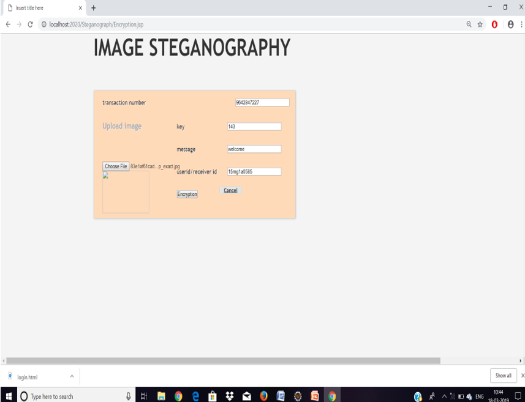
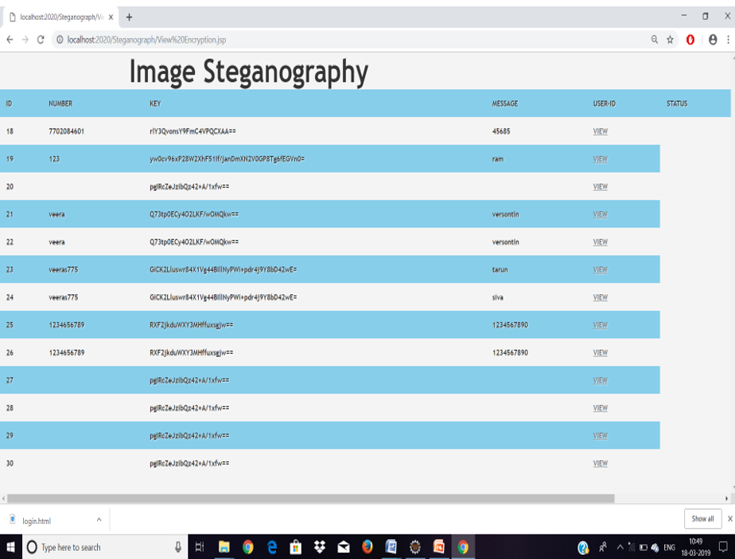

# IMAGE STEGANOGRAPHY HIDDEN INFORMATION - IN JAVA

A desktop application built in Java to securely hide and retrieve secret messages within image files using steganography techniques.

---

## 📌 Overview
This project implements **image steganography**, allowing users to embed confidential text inside images without visibly altering them.  
It was developed as part of an academic course on secure software development.

---

## 🛠 Tech Stack
- **Language:** Java  
- **GUI:** Java Swing  
- **Algorithms:** LSB (Least Significant Bit) based steganography, basic encryption for message security  
- **IDE:** IntelliJ IDEA / Eclipse / NetBeans (choose the one you used)

---

## ✨ Features
- Hide text messages inside PNG/JPG images without noticeable quality loss  
- Retrieve the hidden message from an encoded image  
- User-friendly graphical interface (Swing)  
- Simple and lightweight — runs locally without external dependencies

---

## 🚀 Installation & Usage
1. **Clone the repository:**
   ```bash
   git clone https://github.com/Medhaswini118/image-steganography-java.git
   cd image-steganography-java
2. Open the project in your Java IDE.

3. Build & Run:

   Compile the source files

   Run Main.java (or your main class)

4. Usage:

Launch the GUI

Click Encode → select an image → type your message → save the new image

Click Decode → choose an encoded image to reveal the hidden text

5. ## 📷 Screenshots

### Encoding a message


### Decoding a message


